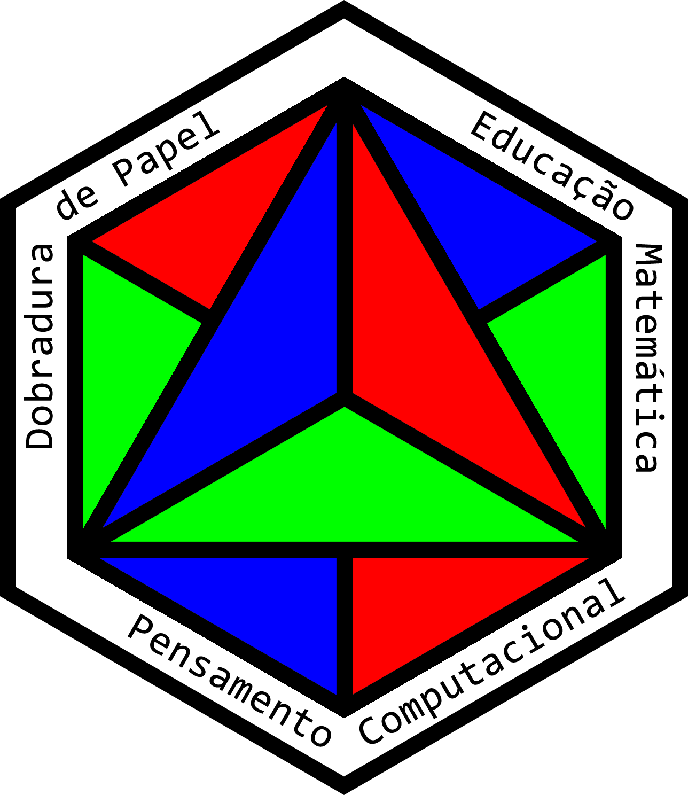

# E-comercer empresa x

vamos criar um **e-comercer** para *empresa* x

## Funcionalidades:

_Negrito dentro do **Italico**_

**Italico dentro do _Negreito_**

###### Melhorias

_Italico com underline_ 
__Negrito com Uderline__

### Linguagens do Projeto ###

* HTML
* CSS
* JavaScript
* PHP
* MySQL

### Funcionalisdas a desenvolver 

1. A
    1. A
    2. B
    3. C
2. B
3. V

### Imagens 

### Links

